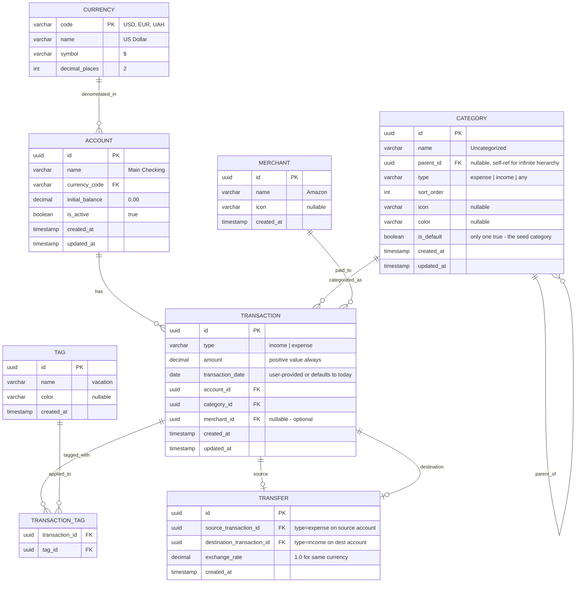
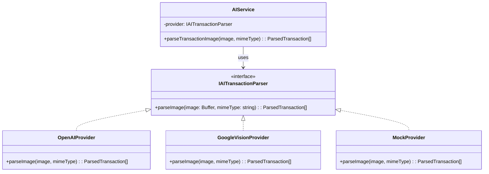

# 🏗️ Finance Manager — Architecture Plan

---

## 1. Project Overview

A **personal finance tracking application** for a single user, deployed on a Raspberry Pi, with mobile access via a future companion app. The core idea: **every transaction is real** — the user manually replicates real-world financial events into the app. No auto-generated or predicted transactions.

### Core Principles
| Principle | Rationale |
|---|---|
| **Reality-first** | Only real, user-confirmed transactions exist in the system. No recurring/predicted entries — every transaction must represent a real-world event |
| **Extensible by design** | Start with 1 currency (USD) and 1 account, but the data model supports N currencies and N accounts from day one |
| **Provider-agnostic AI** | Abstract AI interface so OCR/parsing providers can be swapped without code changes |
| **Analytics-ready schema** | Database designed for future complex queries, charts, and insights — every dimension (time, category, merchant, tag, account, currency) is a first-class entity |
| **No authentication** | Single-user app — whoever has access to the network/machine can use it |

---

## 2. Tech Stack

> [!NOTE]
> All choices were discussed and confirmed by the stakeholder. The guiding principle: **popular enough to be employable, interesting enough to not be boring** — specifically avoiding the "Express + Redux + MUI" default stack.

### Frontend
| Layer | Choice | Why |
|---|---|---|
| **Framework** | **React 19** + **TypeScript** | Latest React with modern patterns; TypeScript for safety. A deliberate learning choice (stakeholder's background is Angular) |
| **Build Tool** | **Vite** | Fast, modern, industry-standard for React |
| **Routing** | **TanStack Router** | Type-safe routing, gaining massive adoption, more modern than React Router — a great skill to learn |
| **Server State** | **TanStack Query (React Query)** | De-facto standard for data fetching/caching in React — essential for any React role |
| **Client State** | **Zustand** | Lightweight, elegant API, very popular — a refreshing alternative to Redux boilerplate |
| **UI Components** | **shadcn/ui** (built on **Radix UI**) | Not a library — copy-paste components you own. Extremely trendy, teaches accessible component patterns |
| **Styling** | **Tailwind CSS v4** | Dominant in the React ecosystem, highly employable. Pairs perfectly with shadcn/ui |
| **Charts** | **Recharts** | React-native charting, simple API, well-maintained, built on D3 |
| **Forms** | **React Hook Form** + **Zod** | Performant forms with schema-based validation |
| **Icons** | **Lucide React** | Clean, consistent icon set (ships with shadcn/ui) |

> [!TIP]
> **Why this is interesting but employable**: TanStack Router + Zustand + shadcn/ui are the "modern wave" — they're rapidly replacing older equivalents (React Router, Redux, MUI) in the industry. Learning them now puts you ahead of most Angular-to-React switchers.

### Backend
| Layer | Choice | Why |
|---|---|---|
| **Runtime** | **Node.js 22+** + **TypeScript** | Full-stack TypeScript = shared types between FE/BE |
| **Framework** | **Fastify** | Faster than Express, built-in schema validation, plugin architecture — lightweight & functional (vs Angular-like NestJS). The "interesting but employable" choice |
| **ORM** | **Drizzle ORM** | Type-safe, SQL-like syntax — you learn SQL as you go. Lightweight (~35KB), no codegen step, schema defined in TypeScript. More modern and interesting than Prisma, lighter for Raspberry Pi |
| **Database** | **PostgreSQL 16** | Recursive CTEs for infinite category hierarchy, complex analytics queries, JSONB for flexible data, window functions for future insights. More valuable career skill. Runs fine on Pi for single-user workloads |
| **Validation** | **Zod** | Shared between FE and BE via a common `shared` package |
| **AI Abstraction** | **Custom adapter pattern** | Simple interface (`parseTransactionImage(image) → Transaction[]`) with swappable providers (OpenAI, Google Vision, local model, etc.). Provider selected via env var |

### Infrastructure
| Layer | Choice | Why |
|---|---|---|
| **Monorepo** | **pnpm workspaces** | Simple, fast, no extra tooling needed |
| **Deployment** | **Raspberry Pi** via Docker Compose | PostgreSQL + API + (optionally) static frontend, all containerized |
| **Reverse Proxy** | **Caddy** | Listens on `:80`/`:443`, serves the web app, and proxies `/api/*` to the API service internally. The browser always uses `/api` as a relative base URL — no ports or hostnames in frontend code. Works identically in dev (Vite proxy) and prod (Caddy). **Required** — the app must be accessible from outside the home network (e.g. from a phone on mobile data) for transaction tracking on the go and for the future mobile companion app |

---

## 3. Monorepo Structure

```
finance-manager/
├── packages/
│   ├── shared/                  # Shared types, Zod schemas, constants
│   │   ├── src/
│   │   │   ├── schemas/         # Zod validation schemas (used by both FE & BE)
│   │   │   ├── types/           # TypeScript types & interfaces
│   │   │   └── constants/       # Shared enums, category defaults, etc.
│   │   ├── package.json
│   │   └── tsconfig.json
│   │
│   ├── api/                     # Backend — Fastify API
│   │   ├── src/
│   │   │   ├── plugins/         # Fastify plugins (db, cors, etc.)
│   │   │   ├── modules/
│   │   │   │   ├── transactions/
│   │   │   │   │   ├── transaction.routes.ts
│   │   │   │   │   ├── transaction.service.ts
│   │   │   │   │   └── transaction.repository.ts
│   │   │   │   ├── categories/
│   │   │   │   │   ├── category.routes.ts
│   │   │   │   │   ├── category.service.ts
│   │   │   │   │   └── category.repository.ts
│   │   │   │   ├── accounts/
│   │   │   │   ├── merchants/
│   │   │   │   ├── tags/
│   │   │   │   └── transfers/
│   │   │   ├── ai/
│   │   │   │   ├── ai.adapter.ts          # Abstract interface
│   │   │   │   ├── providers/
│   │   │   │   │   ├── openai.provider.ts
│   │   │   │   │   ├── google.provider.ts
│   │   │   │   │   └── mock.provider.ts   # For development
│   │   │   │   └── ai.service.ts
│   │   │   ├── db/
│   │   │   │   ├── schema.ts              # Drizzle schema definitions
│   │   │   │   ├── migrations/            # SQL migrations
│   │   │   │   └── seed.ts                # Default data (1 default category, 1 default account, USD currency)
│   │   │   └── app.ts                     # Fastify app entry point
│   │   ├── drizzle.config.ts
│   │   ├── package.json
│   │   └── tsconfig.json
│   │
│   └── web/                     # Frontend — React SPA
│       ├── src/
│       │   ├── components/
│       │   │   ├── ui/          # shadcn/ui components (Button, Dialog, etc.)
│       │   │   ├── layout/      # Shell, Sidebar, Header
│       │   │   ├── transactions/
│       │   │   ├── categories/
│       │   │   └── charts/
│       │   ├── routes/          # TanStack Router route definitions
│       │   ├── hooks/           # Custom React hooks
│       │   ├── api/             # TanStack Query hooks (useTransactions, etc.)
│       │   ├── stores/          # Zustand stores
│       │   ├── lib/             # Utilities, helpers
│       │   └── main.tsx
│       ├── index.html
│       ├── tailwind.config.ts
│       ├── vite.config.ts
│       ├── package.json
│       └── tsconfig.json
│
├── docker-compose.yml           # PostgreSQL + API + Web
├── pnpm-workspace.yaml
├── package.json
└── tsconfig.base.json
```

---

## 4. Database Schema

> [!IMPORTANT]
> The schema is designed for **future analytics** — every dimension you might want to slice data by (time, category, merchant, tag, account, currency) is a first-class entity with proper foreign keys, enabling efficient GROUP BY / JOIN queries later.

### Entity Relationship Diagram



### Key Design Decisions

| Decision | Rationale |
|---|---|
| **`amount` is always positive** | Direction is determined by `type` (income/expense). Simplifies aggregation queries — `SUM(CASE WHEN type='income' THEN amount ELSE -amount END)` |
| **`transaction_date` is a `DATE`, not `TIMESTAMP`** | User only cares about days, not hours. Stored as-is — no timezone conversion needed for dates |
| **`transaction_date` defaults to today** | Optional from the user's perspective — if not provided, backend fills it with the current date |
| **`created_at` / `updated_at` are `TIMESTAMPTZ`** | Stored in UTC for system auditing purposes (when was the record created/modified in the app) |
| **No `note`/`description` field** | Stakeholder confirmed these are not needed |
| **No `attachment` field** | Stakeholder confirmed these are not needed |
| **`merchant_id` is nullable** | Merchant is optional — user assigns it when they know the merchant |
| **Transfer = 2 linked transactions** | A transfer creates an expense on the source account and an income on the destination, linked via the `transfer` table. Account balances are always computable from transactions alone — no separate "transfer" type pollutes aggregation queries |
| **Category `type` field** | Categories can be restricted to `expense`, `income`, or `any` — prevents accidentally filing income under "Groceries" |
| **Category `is_default` flag** | Exactly one category is the default (seed data: "Uncategorized"). Shown to the user as a hint to create their own categories |
| **`parent_id` self-reference** | Enables **infinite hierarchy depth**. A category with `parent_id = NULL` is a root category |
| **Merchant as separate entity** | Enables "how much did I spend at AliExpress" queries without string-matching free text |
| **Tags via junction table** | Many-to-many: one transaction can have multiple tags (e.g., "vacation" + "food"), one tag applies to many transactions. Enables cross-category analysis like "total vacation spending" |
| **Currency as a lookup table** | Pre-populated with common currencies. Accounts reference a currency. Ready for multi-currency without schema changes |
| **Account `initial_balance`** | Allows the user to set a starting balance when onboarding an existing account. Current balance = `initial_balance` + SUM(incomes) - SUM(expenses) |

### Seed Data (on first run)

| Entity | Default Value |
|---|---|
| Currency | `{ code: 'USD', name: 'US Dollar', symbol: '$', decimalPlaces: 2 }` |
| Account | `{ name: 'Main Account', currencyCode: 'USD', initialBalance: 0 }` |
| Category | `{ name: 'Uncategorized', type: 'any', isDefault: true, parentId: null }` |

---

## 5. API Design (REST)

### Transactions
| Method | Endpoint | Description |
|---|---|---|
| `GET` | `/api/transactions` | List with filters (date range, category, merchant, tags, account, type) + pagination |
| `GET` | `/api/transactions/:id` | Get single transaction with related merchant & tags |
| `POST` | `/api/transactions` | Create single transaction. `transactionDate` defaults to today if omitted |
| `POST` | `/api/transactions/bulk` | Create multiple transactions at once |
| `PUT` | `/api/transactions/:id` | Update transaction (amount, category, merchant, tags, date, type) |
| `DELETE` | `/api/transactions/:id` | Delete transaction |

### Categories
| Method | Endpoint | Description |
|---|---|---|
| `GET` | `/api/categories` | Get full category tree (recursive), including depth and children |
| `GET` | `/api/categories/:id` | Get single category with its ancestors path |
| `POST` | `/api/categories` | Create category (specify `parentId` for nesting, or `null` for root) |
| `PUT` | `/api/categories/:id` | Rename or update category (name, icon, color, type) |
| `PUT` | `/api/categories/:id/move` | Move category to a new parent. All subcategories follow automatically |
| `DELETE` | `/api/categories/:id` | Delete category. Requires `reassignTo` query param — all transactions under this category (and its subcategories) are reassigned to the target category. Prevents orphaned data |

### Accounts
| Method | Endpoint | Description |
|---|---|---|
| `GET` | `/api/accounts` | List all accounts with computed current balances |
| `GET` | `/api/accounts/:id` | Get single account with balance |
| `POST` | `/api/accounts` | Create account (name, currency, initial balance) |
| `PUT` | `/api/accounts/:id` | Update account (name, initial balance, is_active) |

### Transfers
| Method | Endpoint | Description |
|---|---|---|
| `POST` | `/api/transfers` | Create a transfer between two accounts (auto-creates 2 linked transactions) |
| `DELETE` | `/api/transfers/:id` | Delete transfer (removes both linked transactions) |

### Merchants
| Method | Endpoint | Description |
|---|---|---|
| `GET` | `/api/merchants` | List all merchants (supports search query for autocomplete) |
| `POST` | `/api/merchants` | Create merchant |
| `PUT` | `/api/merchants/:id` | Update merchant (rename) |
| `DELETE` | `/api/merchants/:id` | Delete merchant (nullifies `merchant_id` on associated transactions) |

### Tags
| Method | Endpoint | Description |
|---|---|---|
| `GET` | `/api/tags` | List all tags (supports search query for autocomplete) |
| `POST` | `/api/tags` | Create tag |
| `PUT` | `/api/tags/:id` | Update tag (rename, color) |
| `DELETE` | `/api/tags/:id` | Delete tag (removes from junction table, transactions remain intact) |

### Analytics (v2+ — schema-ready)
| Method | Endpoint | Description |
|---|---|---|
| `GET` | `/api/analytics/breakdown` | Spending/income by category for a date range |
| `GET` | `/api/analytics/trends` | Monthly income/expense totals over time |
| `GET` | `/api/analytics/by-merchant` | Spending grouped by merchant |
| `GET` | `/api/analytics/by-tag` | Spending grouped by tag |

### AI (v2+ — interface-ready)
| Method | Endpoint | Description |
|---|---|---|
| `POST` | `/api/ai/parse-image` | Upload screenshot → returns parsed transaction candidates for user review before committing |

---

## 6. AI Adapter Architecture (v2+)

> [!NOTE]
> Not implemented in MVP, but the interface is defined from day one so we can plug in any provider later without refactoring.



The active provider is selected via environment variable (`AI_PROVIDER=openai|google|mock`). The `MockProvider` returns hardcoded data for development. The `ParsedTransaction` type is a candidate — the user reviews and confirms before it becomes a real transaction in the system.

---

## 7. MVP Scope (v1)

### ✅ In Scope
1. **Transaction CRUD** — Add, edit, delete income/expense transactions with optional merchant and tags
2. **Category management** — Create, rename, move, delete categories in infinite hierarchy. One default "Uncategorized" category as seed
3. **Simple breakdown** — Pie chart of expenses by category + income vs. expense summary for a selected month
4. **Merchant & Tag support** — Create and assign to transactions via autocomplete
5. **Single account (Main Account), USD** — Schema supports multi-account/multi-currency from day one

### ❌ Out of Scope (v2+)
- AI image parsing (interface defined, not implemented)
- Bulk transaction import
- Multi-account & multi-currency UI
- Transfers between accounts (modeled in schema, no UI yet)
- Advanced analytics (trends, forecasting, anomaly detection, budgets)
- Mobile companion app
- Docker / Raspberry Pi deployment

---

## 8. Implementation Phases

### Phase 1 — Foundation 🏗️
- [ ] Initialize monorepo (pnpm workspaces, root `tsconfig.base.json`)
- [ ] Set up `packages/shared` with Zod schemas and TypeScript types
- [ ] Set up `packages/api` with Fastify + Drizzle + PostgreSQL connection
- [ ] Define full database schema in Drizzle (`schema.ts`)
- [ ] Generate and run initial migration
- [ ] Seed default data (USD currency, Main Account, Uncategorized category)
- [ ] Set up `packages/web` with Vite + React 19 + TanStack Router + Tailwind v4 + shadcn/ui
- [ ] Basic app shell with sidebar navigation

### Phase 2 — Categories Module 📂
- [ ] Category CRUD API (with recursive tree query using PostgreSQL CTEs)
- [ ] Category tree UI (collapsible hierarchy with infinite depth)
- [ ] Move / rename / delete with reassignment
- [ ] Visual indicators (icons, colors)

### Phase 3 — Transactions Module 💸
- [ ] Transaction CRUD API (with filtering & pagination)
- [ ] Add transaction form (type selector, amount, date picker defaulting to today, category tree selector, optional merchant, optional tags)
- [ ] Transaction list view with filters (by date range, category, type, merchant, tag)
- [ ] Edit and delete existing transactions

### Phase 4 — Merchants & Tags 🏷️
- [ ] Merchant & Tag CRUD API with search
- [ ] Autocomplete/combobox selectors in transaction form
- [ ] Simple management pages (list, create, rename, delete)

### Phase 5 — Analytics (Basic) 📊
- [ ] `GET /api/analytics/breakdown` endpoint
- [ ] Expense breakdown by category (pie chart with Recharts)
- [ ] Income vs. Expense summary (bar chart)
- [ ] Month/date-range selector

### Phase 6 — Polish & Deploy 🚀
- [ ] Responsive design (mobile-friendly web for Raspberry Pi access from phone)
- [ ] Error handling, loading states, empty states, toast notifications
- [ ] Docker Compose setup for Raspberry Pi (PostgreSQL + API + static web)
- [ ] Environment variable configuration
- [ ] README & documentation

---

## 9. Key Risks & Mitigations

| Risk | Mitigation |
|---|---|
| PostgreSQL resource usage on Raspberry Pi | Tune `shared_buffers`, `work_mem` for low-RAM environment. Monitor with `pg_stat_activity`. SQLite migration is a fallback if needed (Drizzle supports both) |
| Infinite category hierarchy queries can be expensive | Use PostgreSQL **recursive CTEs** (`WITH RECURSIVE`). Consider **materialized path** pattern (e.g., `/food/groceries/organic`) if performance degrades with deep trees |
| Moving categories with children | Implement as a single DB transaction updating `parent_id`. Child categories stay attached — only the moved category's parent changes. Cycle detection required (can't move a parent into its own descendant) |
| Deleting a category with transactions | API requires a `reassignTo` category ID — transactions in the deleted category (and all its subcategories) are bulk-reassigned, never orphaned |
| AI provider lock-in | Adapter pattern from day 1 — only the provider implementation knows the API details. Switching providers = implementing one new class |
| Stakeholder learning curve (Angular → React) | Each phase introduces a few new concepts incrementally (Phase 1: React basics + Router, Phase 2: Query + forms, Phase 3: complex state, Phase 5: charting). Not everything at once |
